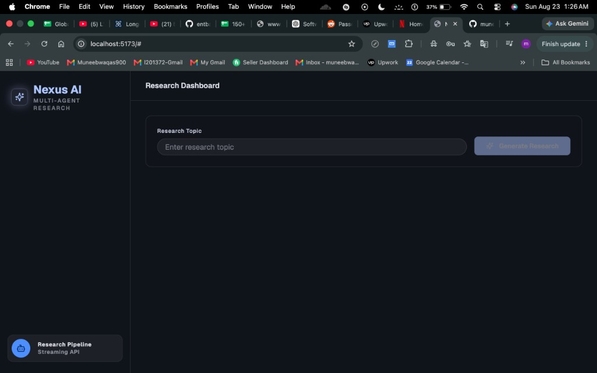

# Nexus AI Workflow Engine

A React + Vite frontend for a LangChain multi-agent research workflow. Enter a topic, stream each research step in real time, and review the generated report, critic feedback, search results, and scraped supporting content.



## Features

- Real-time research progress through server-sent events
- Final research report rendered with Markdown and GitHub-flavored Markdown support
- Critic review and supporting evidence sections
- Responsive dark dashboard layout
- Configurable backend API URL through Vite environment variables

## Tech Stack

- React 19
- Vite 6
- TypeScript
- Tailwind CSS
- Lucide React icons

## Prerequisites

- Node.js 18 or newer
- npm
- A running backend API that exposes:
  - `POST /api/research/`
  - `GET /api/research/stream/?topic=...`

## Getting Started

1. Install dependencies:

   ```bash
   npm install
   ```

2. Create your local environment file:

   ```bash
   cp .env.example .env
   ```

3. Update `.env` if your backend uses a different host or port:

   ```bash
   VITE_API_BASE_URL=http://127.0.0.1:8000/api
   ```

4. Start the development server:

   ```bash
   npm run dev
   ```

5. Open the local URL printed by Vite, usually:

   ```text
   http://localhost:5173
   ```

## Environment Variables

| Variable | Required | Default | Description |
| --- | --- | --- | --- |
| `VITE_API_BASE_URL` | Yes | `http://127.0.0.1:8000/api` | Base URL for the backend research API. |

## Available Scripts

```bash
npm run dev
```

Starts the Vite development server.

```bash
npm run build
```

Type-checks the project and creates a production build in `dist/`.

```bash
npm run preview
```

Serves the production build locally.

```bash
npm run lint
```

Runs ESLint across the project.

## Project Structure

```text
.
├── docs/
│   └── screenshot.png
├── public/
│   └── favicon.png
├── src/
│   ├── api/
│   ├── components/
│   ├── config/
│   ├── hooks/
│   ├── styles/
│   └── types/
├── index.html
├── package.json
└── vite.config.ts
```

## Notes

- Vite only exposes frontend environment variables that start with `VITE_`.
- The favicon is served from `public/favicon.png` and linked in `index.html`.
- Keep secrets out of `.env.example`; commit only placeholder or local-development values.
